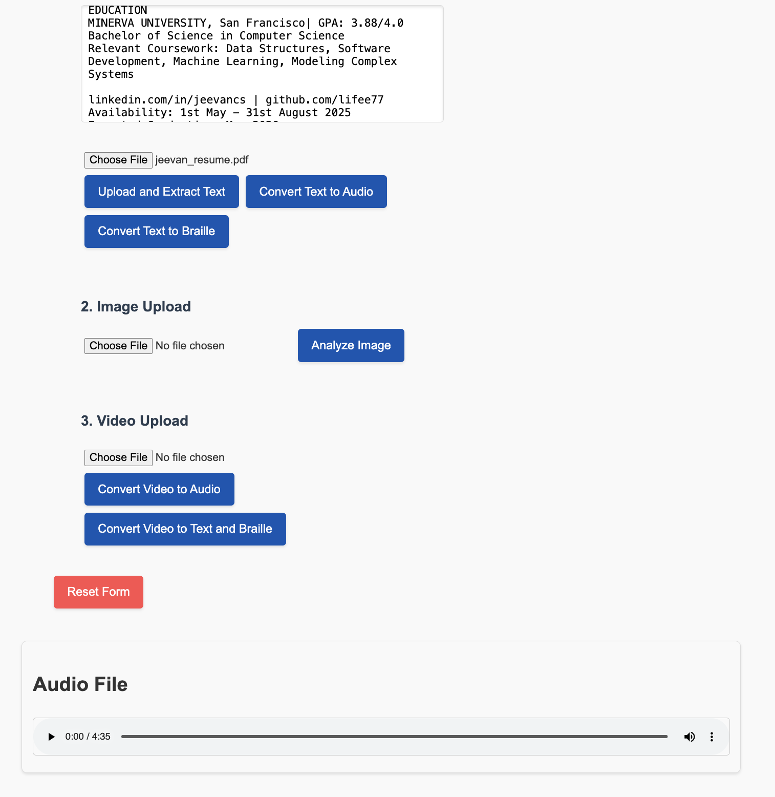

# EduAccess

**EduAccess** is a platform designed to make educational materials accessible for blind and visually impaired individuals. By leveraging cutting-edge technology, EduAccess facilitates the conversion of text, video, and other content into audio or Braille formats, empowering users with enhanced access to knowledge and learning resources.

---

## Features

- **Text-to-Audio Conversion**  
  Upload text files to generate high-quality audio using Azure Cognitive Services.  

- **Video-to-Audio Conversion**  
  Extract audio from videos, making educational and tutorial content accessible.  

- **Text-to-Braille Conversion**  
  Convert text into Braille-compatible formats for use with Braille displays or printers.  

- **Accessible User Interface**  
  Optimized design for screen readers, keyboard navigation, and other accessibility tools.  

- **Multifunctional File Processing**  
  Seamlessly process videos, images, and text within a single platform.  

---

## Table of Contents

- [Features](#features)
- [Project Structure](#project-structure)
- [Setup](#setup)
- [Usage](#usage)
- [Example Workflows](#example-workflows)
- [Azure Configuration](#azure-configuration)
- [Dependencies](#dependencies)
- [Future Enhancements](#future-enhancements)
- [Contributing](#contributing)
- [Screenshots](#screenshots)
- [Demo Video](#demo-video)
- [License](#license)
- [Contact](#contact)

---

## Project Structure

```
EduAccess/
│
├── backend/
│   ├── app.py                # Flask backend API
│   ├── requirements.txt      # Backend dependencies
│   ├── services/             # Modularized backend services
│   │   ├── text_to_speech.py # Azure Text-to-Speech service
│   │   ├── video_to_audio.py # Video-to-audio processing
│   │   ├── braille_converter.py # Braille conversion logic
│   │   └── file_extractor.py # Text extraction from files
│   └── static/
│       └── audio/            # Directory for storing audio files
│
├── frontend/
│   ├── public/
│   │   └── index.html        # Main HTML file
│   ├── src/
│   │   ├── App.js            # Main React component
│   │   ├── components/       # Modular React components
│   │   │   ├── UploadForm.js # File upload and processing form
│   │   │   ├── Player.js     # Audio playback component
│   └── package.json          # Frontend dependencies
│
└── README.md                 # Documentation
```

---

## Setup

### Prerequisites

- Python 3.8 or higher
- Node.js and npm
- Azure Cognitive Services Account

### Backend Setup

1. Navigate to the `backend/` directory:
   ```bash
   cd backend
   ```
2. Install the dependencies:
   ```bash
   pip install -r requirements.txt
   ```
3. Start the Flask server:
   ```bash
   python app.py
   ```

### Frontend Setup

1. Navigate to the `frontend/` directory:
   ```bash
   cd frontend
   ```
2. Install the dependencies:
   ```bash
   npm install
   ```
3. Start the React development server:
   ```bash
   npm start
   ```

---

## Usage

1. Open the application in your browser at `http://localhost:3000`.
2. Choose a feature:
   - Upload text files, videos, or images.
   - Select the desired output format: audio, text or Braille.
3. View or Download the processed file once it is ready.

---

## Example Workflows

### Text-to-Audio Conversion

1. Upload a `.txt` or `.pdf` file.  
2. The system uses Azure Text-to-Speech to generate an `.mp3` file.  
3. Download the audio file to listen offline.  

### Video-to-Audio Conversion

1. Upload a `.mp4` or `.mov` file.  
2. Extract and save the audio as an `.mp3` file.  
3. Download the audio file for playback.  

### Text-to-Braille Conversion

1. Upload a `.txt` file.  
2. Generate and shows Braille encoding.  
3. Export the code to Braille printers or displays. Note, Braille display/printer integration is not yet added.

---

## Azure Configuration

1. **Create Azure Cognitive Services Resources**  
   Set up **Speech Service** and **Vision Service**, and obtain their respective API keys and endpoints.  

2. **Update Environment Variables**  
   Add the following to a `.env` file in the backend directory:
   ```bash
   AZURE_SPEECH_KEY=your_azure_speech_key
   AZURE_SPEECH_REGION=your_azure_speech_region
   VISION_KEY=your_azure_vision_key
   VISION_ENDPOINT=your_azure_vision_endpoint
   ```

3. Ensure the scripts reference these keys:
   - For Text-to-Speech:
     ```python
     speech_config = SpeechConfig(subscription=os.getenv("AZURE_SPEECH_KEY"), region=os.getenv("AZURE_SPEECH_REGION"))
     ```
   - For Vision API:
     ```python
     vision_client = ComputerVisionClient(os.getenv("VISION_ENDPOINT"), CognitiveServicesCredentials(os.getenv("VISION_KEY")))
     ```

---

## Dependencies

### Backend
- **Flask**: Backend framework
- **Azure Cognitive Services SDK**: AI-powered conversions
- **MoviePy**: Video-to-audio processing
- **Liblouis**: Braille translation library

### Frontend
- **React**: Modern UI framework
- **Axios**: HTTP requests for API communication
- **HTML/CSS**: Accessible and responsive design

---

## Future Enhancements

- **Real-Time Audio Streaming**: Stream audio output for large files.
- **OCR Support**: Extract text from images with Optical Character Recognition.
- **Multilingual Support**: Provide translations for multiple languages.
- **Enhanced Braille Options**: Support for tactile graphics and advanced Braille formatting.
- **Cloud Deployment**: Scale the app with platforms like Azure App Service.

---

## Contributing

We welcome your contributions!  
- Report bugs or suggest new features via [GitHub Issues](https://github.com/lifee77/EduAccess/issues).  
- Submit pull requests to the `master` branch for review.  

---

## Screenshots

### Home Page


### Text-to-Audio Conversion


### Video-to-Braille Conversion


---

## Demo Video

[Demo Video](https://www.canva.com/design/DAGbMoJhe78/_xeHYa1ow8HA07lnoqvkfQ/watch?utm_content=DAGbMoJhe78&utm_campaign=designshare&utm_medium=link2&utm_source=uniquelinks&utlId=h8bddc49bb3)

---

## Contact

For inquiries, reach out to the project maintainer at:  
**Email**: jeevanbhattacs@gmail.com  
**GitHub**: [lifee77](https://github.com/lifee77)
